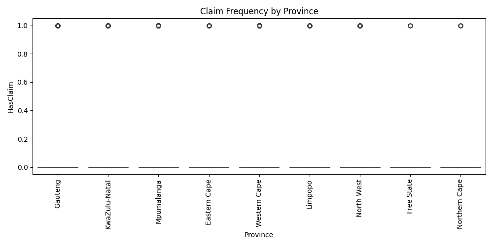
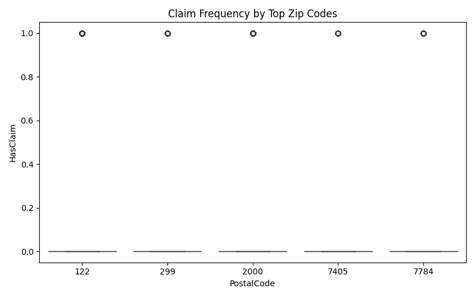
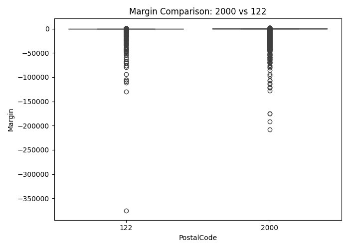
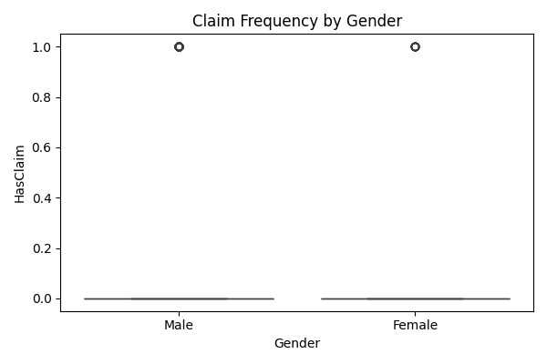

# Task 3: A/B Hypothesis Testing – Risk Analysis for Insurance Segmentation

## Objective
This task evaluates whether specific features (geography, gender) are significantly associated with insurance risk. Risk is measured in terms of **claim frequency**, **claim severity**, and **profit margins**. The results will guide risk-based segmentation and pricing strategy for AlphaCare Insurance Solutions (ACIS).

---

## Selected Metrics

- **Claim Frequency**: % of policies with at least one claim  
- **Margin**: `TotalPremium - TotalClaims`  
- **Binary Claim Variable**: `HasClaim = TotalClaims > 0`  

---

## Data Segmentation

- **Province vs. Claim Frequency**  
- **Top 5 Zip Codes vs. Claim Frequency**  
- **Top 2 Zip Codes vs. Profit Margin**  
- **Gender (Male vs. Female) vs. Claim Frequency**  

Each hypothesis compares two or more groups to test for statistically significant differences in risk.

---

## Statistical Tests Used

| Hypothesis | Test Used | p-value | Decision |
|------------|-----------|---------|----------|
| H₀₁: No risk differences across provinces | ANOVA | 0.0000 | ✅ Rejected |
| H₀₂: No risk differences between zip codes | Kruskal-Wallis | 0.0000 | ✅ Rejected |
| H₀₃: No significant margin difference between zip codes | t-test | 0.1959 | ❌ Not Rejected |
| H₀₄: No risk difference between Women and Men | t-test | NaN | ⚠️ Inconclusive |

---

## Visualizations

- **Claim Frequency by Province**  
  

- **Claim Frequency by Top Zip Codes**  
  

- **Margin Comparison: Two Zip Codes**  
  

- **Claim Frequency by Gender**  
  

---

## Business Insights & Recommendations

### H₀₁: Risk differs by province (p < 0.05)
There are **significant differences in claim frequency across provinces**. This highlights geography as a key risk factor.  
**Recommendation**: Introduce **region-specific premium adjustments**. Provinces like Gauteng, with higher risk, should carry higher premiums.

---

### H₀₂: Risk differs between zip codes (p < 0.05)
Fine-grained zip code analysis also shows significant variation in claim rates.  
**Recommendation**: Use **zipcode-based segmentation** to offer better pricing for low-risk neighborhoods and mitigate loss in high-risk ones.

---

### H₀₃: No significant margin difference (p = 0.1959)
Though risk varies, margins do not significantly differ between the zip codes tested.  
**Recommendation**: Focus on risk-based pricing rather than margin-based targeting at the zipcode level.

---

### H₀₄: Gender test failed (p = NaN)
The test for gender-based risk was **inconclusive**, possibly due to missing or unbalanced data.  
**Recommendation**: Investigate data quality for `Gender`, and avoid gender-based pricing until clean results are obtained.

---

## Conclusion

The A/B testing confirms that **location is a strong determinant of insurance risk**, while **gender differences remain unclear**. These insights will be used to inform geographic segmentation strategies and build more accurate pricing models in the next phase (Task 4: Statistical Modeling).
